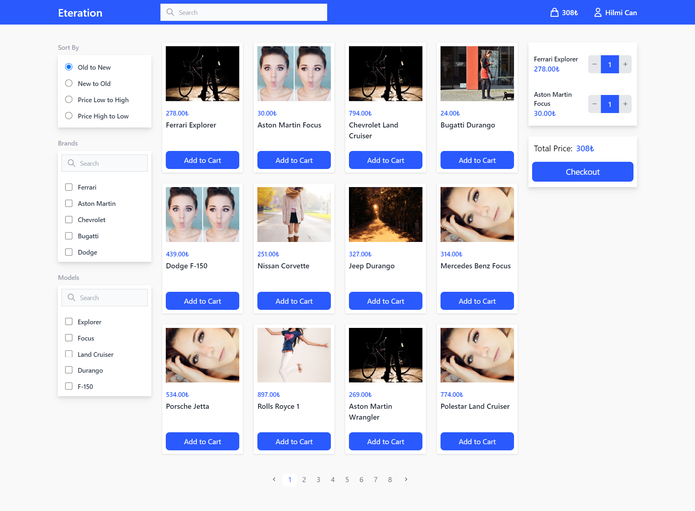
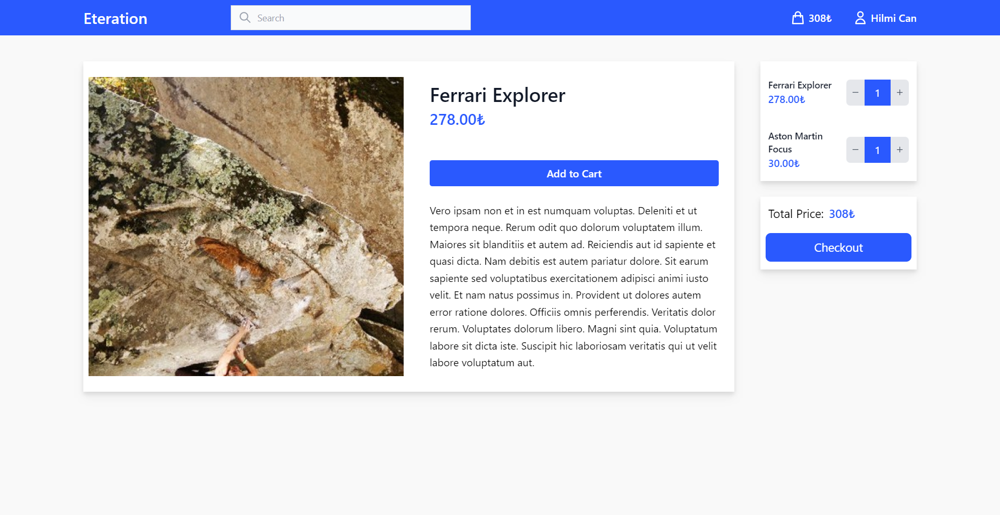

# Eteration Frontend Case Study 
An application built with React, Redux, TypeScript, and TailwindCSS.

## Pages
 - Product Listing Page(Home)
 - Product Detail Page(Product)
 
## Features
 - Product Listing Page
 - Product Detail Page
 - Get Data From [mockAPI](https://5fc9346b2af77700165ae514.mockapi.io/products)
 - Pagination
 - Cart(Add & Remove Product)
 - Filtering
 - Search

## Screen Shots
Product Listing Page:

Product Detail Page:

## Installation 

Installation:

`yarn install`

To Run Tests: 

`yarn test`  

To Start Server: 

`yarn start` 

To Visit App: 

`localhost:3000`  